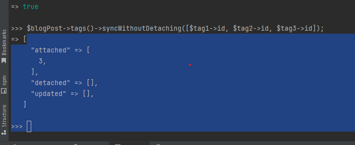
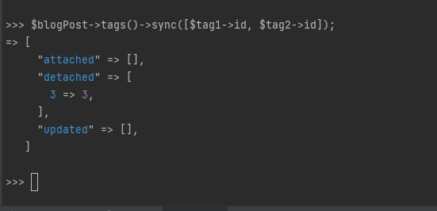
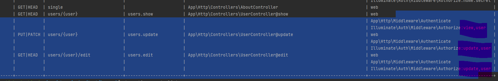

Eloquent
BlogPosts::all();
BlogPosts::find(1);
BlogPosts::find([1,2,3]);
BlogPosts::findOrFail(2);

$post = new BlogPosts();
...
$post->save();

Query builder
User::factory()->count(5)->create();
User::where('id', '>=', 2)->orderBy('id', 'desc')->get();

BlogPost::orderBy('created_at', 'desc')->take(5)->get()

composer require laravel/ui
php artisan ui bootstrap
php artisan ui:controllers

sudo npm install --global cross-env
npm install (--no-bin-links)
npm run dev
npm install sass-loader@10.1.1 --no-bin-links

php artisan cache:clear
php artisan make:test HomeTest
php artisan make:test PostTest

# One to One relationship
**Assigning relationship**
php artisan tinker

    Case 1:
    $author = new Author();
    $author->save();
    $profile = new Profile();
    $author->profile()->save($profile);

    Case 2:
    $author = Author::create();
    $profile = new Profile();
    $profile->author()->associate($author)->save();

    Case 3:
    $profile = new Profile();
    $author = Author::create();
    $profile->author_id = $author->id;
    $profile->save();

**One to One Assigning relationship**
php artisan tinker

    Lazy load 1:
    $author = Author::find(1);
    $author->profile

    Lazy load 2:
    $profile = Profile::find(3);
    $profile->author

    Eage load 1:
    $author = Author::with('profile')->whereKey(1);
    $author = Author::with('profile')->whereKey(1)->first();

    Eage load 2 miltyple related entities:
    $author = Author::with(['profile', 'comments'])->whereKey(1)->first();

# One to many relationship
**Generate model**

php artisan make:model Comment -m

```
    // function name is blogPost ( camel case , laravel will look for blog_post_id
    // function name is post ( camel case , laravel will look for post_id
    public function blogPost()
    {
        // return $this->belongsTo('App\BlogPost', 'post_id', 'blog_post_id');
        return $this->belongsTo('App\Models\BlogPost');

    }
```
**Add data**
case 1
$comment = new Comment();
$comment->content = 'comment 1';
$blog->comments()->save($comment);

case 2
$comment2 = new Comment();
$comment2->content = 'comment 2';
$comment2->blogPost()->associate($blog)->save();

case 3
$comment3 = new Comment();
$comment3->content = 'comment 3';
$comment3->blog_post_id = $blog->id;
$comment3->save();

case 4 save many
$comment5 = new Comment();
$comment5->content = 'comment 5';
$comment4 = new Comment();
$comment4->content = 'comment 4';
$blog->comments()->saveMany([$comment4, $comment5]);

**Fetch data**

Eage load
BlogPost::with('comments')->get();
BlogPost::all();

Lazyload
Case 1:
$post = BlogPost::find(1);
$post->comment
Case 2:
$comment = Comment::find(1);
$comment->blogPost;

# Querying relationship existence
BlogPost::has('comments')->get();

$comment = new Comment();
$comment->content = 'abc';
$comment->blog_post_id = 3;
$comment->save();

**fetch all blog post that have at least 2 comment**

BlogPost::has('comments', '>=', 2)->get();

**fetch all blog post that comment that have content contain 'abc'**
BlogPost::whereHas('comments', function ($query) {
    $query->where('content', 'like', '%abc%');
})->get();

# Querying relationship absence
BlogPost::doesntHave('comments')->get();

BlogPost::whereDoesntHave('comments', function ($query) {
$query->where('content', 'like', '%abc%');
})->get();

# Counting reladted models

$post = BlogPost::withCount('comments')->get();
echo $post->comments_count;

BlogPost::withCount(['comments', 'comments as new_comments' => function ($query) {
    $query->where('created_at', '>=', '2022-07-13 15:51:45');
}])->get();

# Models factory introduction [https://laravel.com/docs/8.x/database-testing#persisting-models](https://laravel.com/docs/8.x/database-testing#persisting-models)

php artisan make:factory CommentFactory --model=Comment

php artisan tinker
Comment::factory()->count(3)->create(['blog_post_id' => 2])

# Model factory callbacks [https://laravel.com/docs/8.x/database-testing#factory-callbacks](https://laravel.com/docs/8.x/database-testing#factory-callbacks)
php artisan make:factory AuthorFactory
php artisan make:factory ProfileFactory

public function configure()
{
    return $this->afterCreating(function (Author $author) {
        $author->profile()->save(Profile::factory()->make());
    });
}

# Authentication
**IMPORTANT: Laravel 7 and Laravel 8 Changes**
composer require laravel/ui
php artisan ui:controllers

# Guest Middleware 
$this->middleware('guest')->except('logout');
'guest' => \App\Http\Middleware\RedirectIfAuthenticated::class,
return redirect(RouteServiceProvider::HOME);

# Csrf
VerifyCsrfToken
Illuminate\Foundation\Http\Middleware\VerifyCsrfToken
session storage in : storage/framework/sessions

# Seeding
php artisan make:migration add_user_to_blog_posts_table

**For table already have record exist**
$table->unsignedBigInteger('user_id')->default(0); or $table->unsignedInteger('user_id')->nullable()

**rollback all migration then run them again**
php artisan migrate:refresh
php artisan migrate:refresh --seed

**Generate seeding file**
php artisan make:seeder UsersTableSeeder
php artisan make:seeder BlogPostsTableSeeder
php artisan make:seeder CommentsTableSeeder

**Load all seeder in database**
php artisan db:seed
or run individual seeder class
php artisan db:seed --class=UsersTableSeeder

BlogPost::factory(50)->create()
BlogPost::factory(50)->make() : make not save immediately

composer dump-autoload : run after create any seeder class

**Seeder interactive**
abstract class Seeder
 * 
 * @var \Illuminate\Console\Command
 */
protected $command;
 * 
`
if ($this->command->confirm('Do you want to refresh the database?')) {

$this->command->call('migrate:refresh');
$this->command->info('Database was refreshed');
}
`
then run :
php artisan db:seed
or
php artisan db:seed -n : use default paramater value

**relation delete using database**
php artisan make:migration AddCascadeDeleteToCommentsTable
php artisan migrate

**soft delete**
php artisan make:migration AddSoftDeletesToBlogPostsTable
php artisan migrate => create column deteted_at

**query soft delete**

php artisan tinker
*     BlogPost::all()->pluck('id'); => get list blog post id NON include deleted
*     BlogPost::withTrashed()->get()->pluck('id');
*     BlogPost::onlyTrashed()->get()->pluck('id');
*     BlogPost::onlyTrashed()->where('id', 13)->get()->pluck('id');
  *     $all = BlogPost::withTrashed()->get();
  *     $post = $all->find(2)
  *      $post->trashed() will return true

**soft delete relation**

php artisan make:migration AddSoftDeleteSToCommnentsTable
php artisan migrate
$post = BlogPost::has('comments')->get()->first();
$post->delete();

**soft delete relation**
$post = BlogPost::onlyTrashed()->find(3);
$post->restore();

**absolute delete (Non revertable)**
$post->forceDelete(); ( using ->onDelete('cascade'); wil delete also in comments )

**verify permissions of the user using Gate**

gate suggest for using verify permission without model 
Gate::forUser($user)->denies('update-post', $post);
Gate::forUser($user)->allows('update-post', $post);

**Policy**

php artisan make:policy BlogPostPolicy
php artisan make:policy BlogPostPolicy --model=BlogPost

way 1 :
Explain:
Gate::define('posts.delete', 'App\Policies\BlogPostPolicy@delete');
posts.delete: 'delete' keyword mapping with 'BlogPostPolicy@delete' function.

way 2 :
protected $policies = [
'App\Models\BlogPost' => 'App\Policies\BlogPostPolicy',
];
$this->authorize('update', $post);
with 'update' is function inside BlogPostPolicy

way 3 :

Mapping method from controller action to Policy

`
[
'show' => 'view',
'create' => 'create',
'store' => 'create',
'edit' => 'update',
'update' => 'update',
'destroy' => 'delete',
]`


**Some tinker test**
User::scopeWithMostBlogPostsLastMonth()->get();


**Working with cache**
cache config file : cache.php
Cache::put('data', 'Hello from cache', 50);
Cache::has('data');
Cache::get('data');
// get with default value
Cache::get('data2', 'Hello');
// increament value +1
Cache::increment('counter');
Cache::increment('counter');
Cache::decrement('counter');

**Cache rags**
```laravel
Cache::tags(['people', 'artists'])->put('John', 'Hello Um John', 10)
Cache::tags(['people', 'authors'])->put('Anne', 'Hello Um Anne', 10)
Cache::tags(['people'])->flush()

```


# Many to many relation
php artisan make:migration CreateTagsTable
**Pivot table**
php artisan make:migration CreateBlogPostTagTable
pivot table should have name as model name but convert to uppercase

```

    public function up()
    {
        Schema::create('blog_post_tag', function (Blueprint $table) {
            $table->id();
            $table->unsignedBigInteger('blog_post_id')->index();
            $table
                ->foreign('blog_post_id')
                ->references('id')
                ->on('blog_posts')
                ->cascadeOnDelete()
            ;
            $table->unsignedBigInteger('tag_id')->index();
            $table
                ->foreign('tag_id')
                ->references('id')
                ->on('tags')
                ->cascadeOnDelete()
            ;
            $table->timestamps();
        });
    }
```
php artisan make:model Tag -m

**168 Defining Many to many on model**
```
    public function tags()
    {
        return $this->belongsToMany('App\Tag');
    }
    ...
    public function blogPosts()
    {
        return $this->belongsToMany('App\BlogPost');
    }
    
    => pivot table will convert form BlogPostTag to blog_post_tag 
```

$tag1 = new App\Models\Tag();
$tag1->name = "Science";
$tag1->save();

$tag2 = new App\Models\Tag();
$tag2->name = "Politics";
$tag2->save();

$blogPost = BlogPost::find(1);

# 169
case 1:
$blogPost->tags()->attach($tag1);
case 2: Note it will cause duplicate record in blog_post_tag
$blogPost->tags()->attach([$tag1->id, $tag2->id]);
case 3:
$tag3 = new App\Models\Tag();
$tag3->name = "Sport";
$tag3->save();
$blogPost->tags()->syncWithoutDetaching([$tag1->id, $tag2->id, $tag3->id]);

$blogPost->tags()->sync([$tag1->id, $tag2->id]);

Node: sync vs syncWithoutDetaching is that with sync if not provide one relations that already exist on table, it actually removed 

$blogPost->tags()->detach($tag1);
$blogPost->tags()->attach($tag3);
**remove all association**
$blogPost->tags()->detach();
$blogPost->tags()->sync([]);

# 170 Querying the many to many relation and pivot tables ( add timestamp for tracking updated_at and created_at )
$blogPost = BlogPost::find(1);
$blogPost->tags()->sync([1, 2]);
$tags = $blogPost->tags;
$tags[0]->pivot;
$tags[0]->pivot->created_at;

$tag = App\Models\Tag::find(1);
$tag->blogPost;
$tag->blogPost->pivot;

```
public function blogPosts()
    {
        return $this->belongsToMany('App\Models\BlogPost')->withTimestamps()
            ->as('tagged')
            ;
    }
```

$tag = App\Models\Tag::find(1);
$tag->blogPost->tagged;


php artisan make:controller PostCommentController
php artisan make:request StoreComment

php artisan storage:link

php artisan make:model Image --migration


php artisan make:controller UserController --resource --model=User
**policy :**



polymorphic relation

imageable_id : 'image' is table then 'able' then 'id'
imageable_type : 'image' is table then 'able' then 'type'
$table->morphs('imageable');

**One to many polymorphic migration and relation**
php artisan make:migration AddPolymorphToCommentsTable

**Popymorphic Table name check**
Str::plural($tablename);

# Mail
https://mailtrap.io/inboxes/354826/messages

MAIL_MAILER=smtp
MAIL_HOST=smtp.mailtrap.io
MAIL_PORT=2525
MAIL_USERNAME=...
MAIL_PASSWORD=...
MAIL_ENCRYPTION=tls
MAIL_FROM_ADDRESS=null
MAIL_FROM_NAME="${APP_NAME}"

**make mail command**
php artisan make:mail CommentPosted
php artisan make:mail CommentPostedMarkdown --markdown=emails.posts.commented-markdown.blade.php

** copy vendor to resource application view **
php artisan vendor:publish --tag=laravel-mail

# Queues and Background Processing
**change config:**
QUEUE_CONNECTION=sync => QUEUE_CONNECTION=database
**create job table**
php artisan queue:table
php artisan migrate
**run job by command**
php artisan queue:work --tries=3
